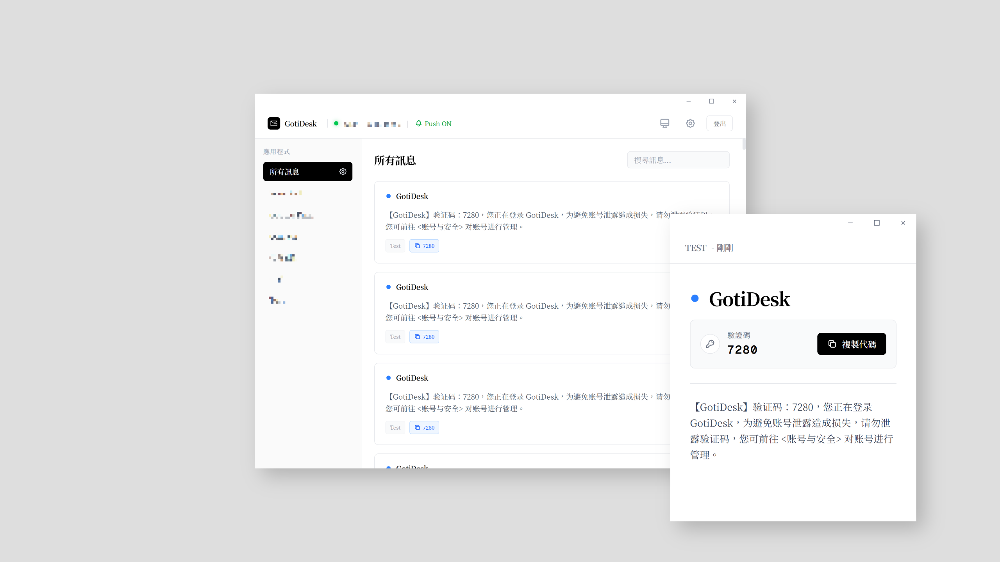

[English](./README.md) | [繁體中文](./README.zh-TW.md) | [简体中文](./README.zh-CN.md)

---

# GotiDesk

一款基于 Tauri v2 与 Svelte 5 打造，简洁、轻量且拥有原生体验的 [Gotify](https://gotify.net/) 桌面端接收器。GotiDesk 专为 Windows 桌面环境深度整合而设计，能提供稳定可靠的 WebSocket 推送通知，且无需承受传统 Electron 应用的高资源占用。



## 核心功能

- **Windows 原生通知：** 调用 Windows 10/11 原生的 Toast API，提供完美契合系统体验的通知弹窗。
- **系统托盘整合：** 安静地在后台运行，提供支持多语言的托盘右键菜单。
- **精细的应用管控：** 您可以为不同的 App 单独设置通知优先级、单独开启或关闭推送，或是应用全局设置。
- **开机自启动：** 支持通过 Windows 注册表 (Registry) 设置，在系统开机时自动于后台启动 GotiDesk。
- **极简 UI 设计：** 采用纯粹的黑白灰单色调美学设计，由 Tailwind CSS 驱动，并完美支持深色模式 (Dark Mode)。
- **盘古之白 (中英排版)：** 自动在中文字符与半角英文、数字之间加入空格，提供最舒适的文字阅读体验。
- **极致性能：** 底层基于 Rust 构建，内存占用极低，运行极为流畅。

## 安装指南

您可以前往 [Releases](../../releases) 页面下载最新版本的 Windows 安装包（`.msi` 或 `.exe`）。

1. 运行安装程序并完成常规安装步骤。
2. 从开始菜单启动 GotiDesk。
3. 在设置界面中输入您的 Gotify 服务器网址 (Server URL) 与客户端令牌 (Client Token) 即可连接。

## 开发者设置

若要在本地编译或运行 GotiDesk，您需要准备 [Node.js (v20+)](https://nodejs.org/)、[pnpm](https://pnpm.io/)，以及 [Rust 编译工具链](https://rustup.rs/)。

### 1. 克隆项目源码
```bash
git clone https://github.com/ChiesiMario/GotiDesk.git
cd GotiDesk
```

### 2. 安装依赖包
```bash
pnpm install
```

### 3. 启动开发服务器
```bash
pnpm tauri dev
```

### 4. 编译正式版 (Windows)
```bash
pnpm tauri build
```

## 技术架构

- **前端：** Svelte 5, TypeScript, Vite, Tailwind CSS v4.
- **后端：** Rust, Tauri v2.
- **平台专属 API：** 使用 `winreg` 处理开机自启动，使用 `tauri-winrt-notification` 触发原生 Windows 通知。

## 授权条款

采用 MIT License 授权。详情请参阅 `LICENSE` 文件。
